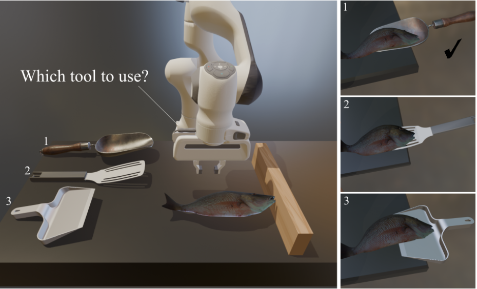
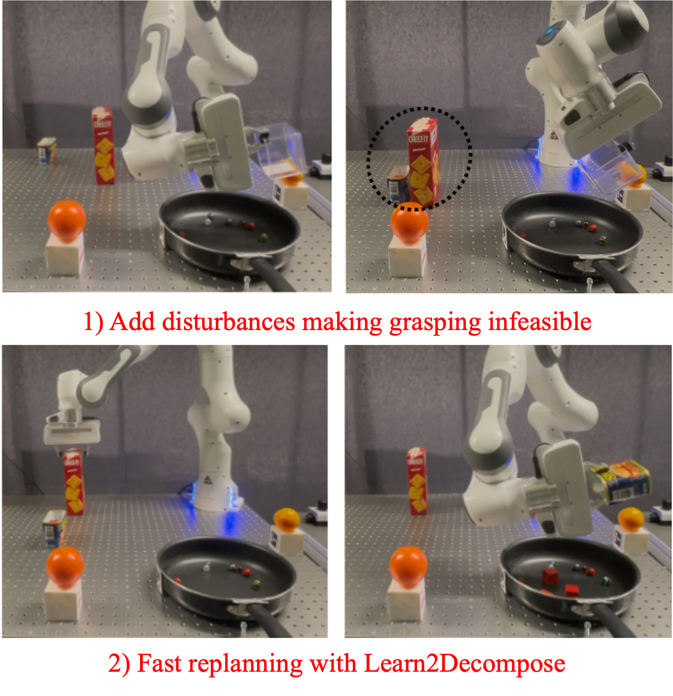


  
You can also find my articles on <a href="{{site.author.googlescholar}}">my Google Scholar profile</a>.



  

    

      

    

  

  

  **Monte Carlo Tree Search with Tensor Factorization for Robot Optimization**

  Teng Xue, **Yan Zhang**, Amirreza Razmjoo, Sylvain Calinon

  Under review

  [[paper]](https://arxiv.org/abs/2507.04949)
  [[website]](https://sites.google.com/view/tt-ts)
  

  

  

    

      
    

  

  

  **Robustness-Aware Tool Selection and Manipulation Planning with Learned Energy-Informed Guidance**

  Yifei Dong\*, **Yan Zhang\***, Sylvain Calinon, Florian T. Pokorny

  Under review, arXiv preprint arXiv:2506.03362, 2025 

  [[paper]](https://arxiv.org/pdf/2506.03362)
  [[video]](https://www.youtube.com/watch?v=9AscO-jRgrY&t=6s)
  

  

  

    

      
    

  

  

  **Learn2Decompose: Learning Problem Decomposition for Efficient Sequential Multi-object Manipulation Planning**

  **Yan Zhang**, Teng Xue, Amirreza Razmjoo, Sylvain Calinon

  In IEEE RA-L 2025.

  [[paper]](https://arxiv.org/pdf/2408.06843v4)
  [[website]](https://sites.google.com/view/problem-decomposition-ral?usp=sharing)
  

  

  

    

      
    

  

  

  **Logic Learning from Demonstrations for Multi-step Manipulation Tasks in Dynamic Environments**

  **Yan Zhang**, Teng Xue*, Amirreza Razmjoo*, Sylvain Calinon

  In IEEE RA-L 2024.

  [[paper]](https://ieeexplore.ieee.org/abstract/document/10569055)[[website]](https://sites.google.com/view/logic-lfd/)
  [[code]](https://github.com/ollieyzhang/Logic-LfD)
  

  

  

    

      
    

  

  

  **Representing Robot Geometry as Distance Fields: Applications to Whole-body Manipulation**

  Yiming Li, **Yan Zhang**, Amirreza Razmjoo, Sylvain Calinon

  In Proc. IEEE ICRA 2024.

  [[paper]](https://arxiv.org/pdf/2307.00533)[[website]](https://sites.google.com/view/lrdf)
  [[code]](https://github.com/yimingli1998/RDF)
  

  

    

      
    

  

  

  **Learning and Generalizing Variable Impedance Manipulation Skills from Human Demonstrations**

  Yan Zhang, Fei Zhao, Zhiwei Liao

  In Proc. IEEE/ASME Intl Conf. on Advanced Intelligent Mechatronics (AIM) 2022.

  [[paper]](https://ieeexplore.ieee.org/abstract/document/9863389)
  

