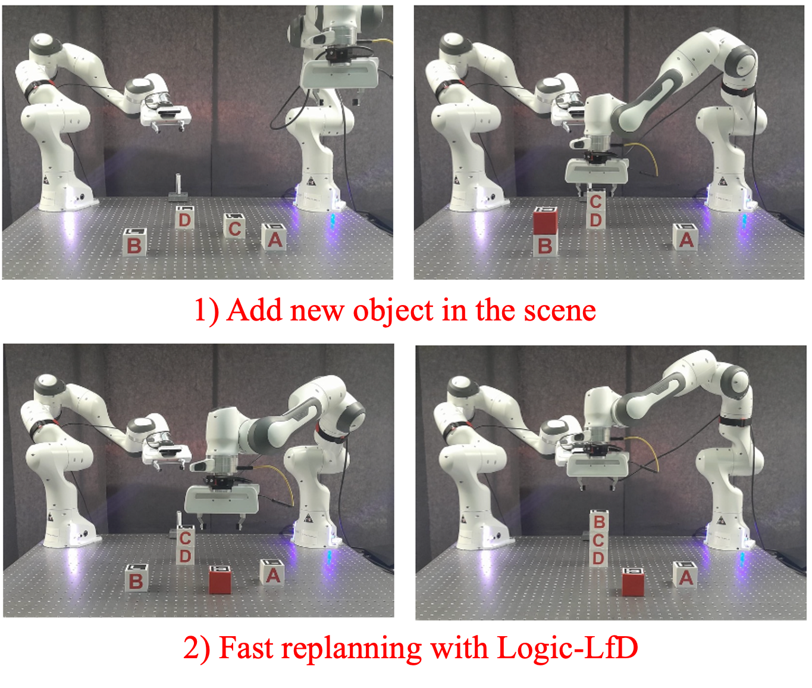
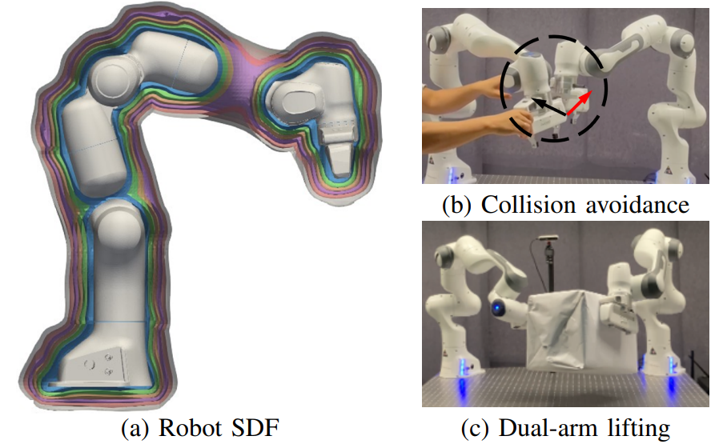
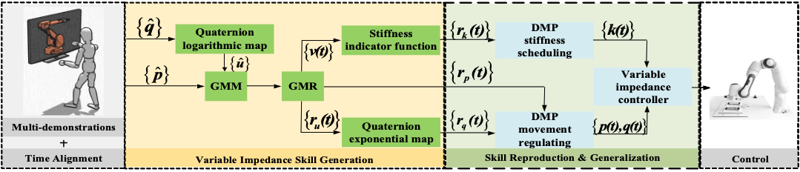


  
You can also find my articles on <a href="{{site.author.googlescholar}}">my Google Scholar profile</a>.



  

    

      
    

  

  

  **Logic Learning from Demonstrations for Multi-step Manipulation Tasks in Dynamic Environments**

  **Yan Zhang**, Teng Xue*, Amirreza Razmjoo*, Sylvain Calinon

  In IEEE RA-L 2024.

  [[paper]](https://ieeexplore.ieee.org/abstract/document/10569055)[[website]](https://sites.google.com/view/logic-lfd/)
  [[code]](https://github.com/ollieyzhang/Logic-LfD)
  

  

  

    

      
    

  

  

  **Representing Robot Geometry as Distance Fields: Applications to Whole-body Manipulation**

  Yiming Li, **Yan Zhang**, Amirreza Razmjoo, Sylvain Calinon

  In Proc. IEEE ICRA 2024.

  [[paper]](https://arxiv.org/pdf/2307.00533)[[website]](https://sites.google.com/view/lrdf)
  [[code]](https://github.com/yimingli1998/RDF)
  

  

    

      
    

  

  

  **Learning and Generalizing Variable Impedance Manipulation Skills from Human Demonstrations**

  Yan Zhang, Fei Zhao, Zhiwei Liao

  In Proc. IEEE/ASME Intl Conf. on Advanced Intelligent Mechatronics (AIM) 2022.

  [[paper]](https://ieeexplore.ieee.org/abstract/document/9863389)
  

